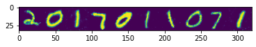

# 个人信息与环境

杨雅儒，2017011071。

Ubuntu 20.04。

# 配置过程

## 安装 Docker

直接使用以下命令即可安装：

```
sudo apt update
sudo apt install docker.io
sudo systemctl enable --now docker
```

## 安装 CUDA

* 首先安装 nvidia 驱动，在 Software & Updates 中点击 Additional Drivers，选择使用 nvidia-driver-440，安装完成后重启即可。
* 此时可以通过 nvidia-smi 查看支持的 CUDA 版本，我这里是 10.2。
* 到 https://developer.nvidia.com/cuda-toolkit-archive 下载并安装 10.2 版本的 CUDA。

## 安装 Nvidia-Docker2

* 首先添加 repositories：

```
curl -s -L https://nvidia.github.io/nvidia-docker/gpgkey | \
 sudo apt-key add -
distribution=$(. /etc/os-release;echo $ID$VERSION_ID)
curl -s -L https://nvidia.github.io/nvidia-docker/$distribution/nvidia-docker.list | \
 sudo tee /etc/apt/sources.list.d/nvidia-docker.list
sudo apt-get update
```

* 然后进行安装即可：

```
sudo apt-get install -y nvidia-docker2
sudo pkill -SIGHUP dockerd
```


## 运行 Jittor-CUDA

直接执行下面指令即可（第一次执行会自动下载镜像）：

```
docker run --gpus all -it --network host jittor/jittor-cuda
```

# 生成图片过程

使用预训练的模型生成图片，代码见 CGAN.py。

生成的图片如下：


